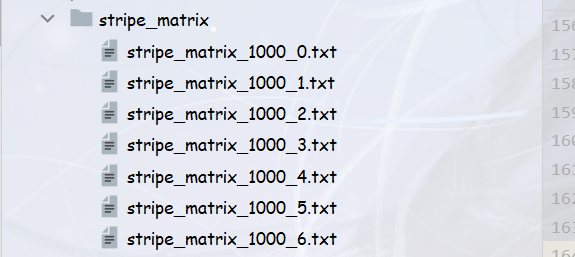

# 期中作业：Compute the PageRank scores on the given dataset

## 数据集说明

采用指定数据集——“data.txt”。文件每行表示一条有向边，格式为：`FromNodeID ToNodeID`。

## 关键代码细节

我们分别实现了基础算法（Base Algorithm, BA）、基础分块算法（Block-based Update Algorithm, BBUA）、条带分块算法（Block-Stripe Update Algorithm, BSUA），基础算法的实现考虑了 dead ends 和 spider trap 节点、进行了优化稀疏矩阵，基础分块算法和条带分块算法进一步实现了两种分块运算。

### 稀疏矩阵优化

对于邻接矩阵$M$，使用类似COO的方式进行稀疏矩阵优化。对于每一个节点，记录从其出发的所有边到达的节点。为了简化后续计算，同时存储出度。

```python
def get_sparse_matrix(file, sparse_matrix):
    from collections import defaultdict
    m = defaultdict(lambda: [0, []])
    nodes = set()
    with open(file, 'r') as f:
        for line in f:
            from_, to = [int(x) for x in line.split()]
            m[from_][0] += 1
            m[from_][1].append(to)
    with open(sparse_matrix, 'w') as f:
        for from_, (degree, tos) in sorted(m.items(), key=lambda x: x[0]):
            f.write("{} {} {}\n".format(from_, degree,
                                        ' '.join(str(x) for x in sorted(tos))))
            nodes.add(from_)
            for to in tos:
                nodes.add(to)
    return sorted(nodes)
```

### 孤立节点的处理

我们将孤立节点直接移除，并不参与运算。为了实现节点`id`与数组下标的对应，建立`id2idx`的对应关系。

```python
nodes = get_sparse_matrix(edges, sparse_matrix)
id2idx = {}
for idx, id in enumerate(nodes):
  id2idx[id] = idx
```

### dead ends 与 spider trap的处理

由于这些节点的存在，会导致$r^{new}$之和不为$1-\beta$，因此需要标准化，使其和为$1-\beta$。由于本身就要将$\beta$均分给所有节点，因此可以通过计算$S=\sum_{j}r^{new}$，使用$1-S$代替$\beta$即可。即$r_j^{new}=r_j'^{new}+\frac{1-S}{N}$。

### 基础算法

基础算法假设$r^{new}$可以储存在内存中，而$r^{old}$和矩阵$M$不足以存储在内存中。对于每一个节点，需要读取$M$中对应的的度数和所到达的节点。为了更新到达节点的分数，需要遍历所有的$r_{old}$。$M$遍历结束后，$r_{new}$中所有分数得到了更新，将其写回存储，即可完成一次迭代。每次迭代，需要读取两次$r_{old}$，用于计算分数和计算误差，需要写回一次$r_{old}$，读取一次$M$。因此每次迭代读写次数为$3|r|+|M|$。

主要迭代代码如下：

```python
init = (1 - beta) / nodes_num
r_new = [init] * nodes_num
with open(sparse_matrix, 'r') as f:
    for line in f:
        tos = line.split(' ')
        read_num += len(tos)
        from_ = int(tos[0])
        degree = int(tos[1])
        tos = tos[2:]
        from_idx = id2idx[from_]
        while (r_file_idx != from_idx):
            r_file_idx += 1
            read_num += 1
            _ = r_file.readline()
        r_ = float(r_file.readline())
        if r_ != r[from_idx]:
            print('hi')
        r_file_idx += 1
        read_num += 1
        for to in tos:
            idx = id2idx[int(to)]
            r_new[idx] += beta * r_ / degree
r_file.close()
r_new_sum = sum(r_new)
delta = (1 - r_new_sum) / nodes_num
r_new = [r_ + delta for r_ in r_new]
err = 0
with open(r_old, 'r') as f:
    idx = 0
    for line in f:
        read_num += 1
        r_ = float(line)
        err += abs(r_ - r_new[idx])
        idx += 1
with open(r_old, 'w') as f:
    for r_ in r_new:
        write_num += 1
        f.write('{}\n'.format(r_))
r = r_new
```

### 基础分块算法

基础的分块算法将新的分数列表分为若干子块，对每个子块的计算分别需要遍历一次矩阵和旧的分数。由于 delta(即$\frac{1-\sum_{j} r'^{new}_{j}}{N} $)只能在所有分块遍历结束后获得，而每个分块在各自对应遍历结束后就需要写入文件。为了保证不额外进行读写，文件中写入的新的分数不包含delta项，下一次读取后再加上delta项。这样处理后，可以保证读写次数为$K|M|+(K+1)|r|$。

这段代码是为计算某个子块而遍历矩阵时，对矩阵某一行进行计算的代码，与基础算法稍有不同，仅对子块内的分数项进行更新。

```python
while r_old_file_idx <= from_idx: #顺序读取上一次迭代的分数
    # old_rfile保存的分数不包含delta项，需加上
    curr_old_r = float(old_rfile.readline())+delta_old
    read_num += 1
    if r_old_file_idx in block_range: #保存相关分数项，用于计算当前误差
        r_old[r_old_file_idx]=curr_old_r
    r_old_file_idx += 1

for to in tos:            #遍历所有目的节点
    idx = id2idx[int(to)] #目的节点编号
    if idx in block_range:
        r_new[idx] += beta * curr_old_r / degree # 累加
```

为了保证不额外进行读写，需要在遍历时就计算误差，但是此时新的分数还不包含 delta 项，因此做如下近似处理。

```python
#计算err
for idx in r_old.keys():
    err+=abs((r_new[idx]-(r_old[idx]-delta_old))/beta)
```

### 条带分块算法
条带分块算法在基础分块算法上对内存占用进行了进一步的优化。该算法将原有的稀疏矩阵拆分成若干块，每一块只保留目的节点为当前分块中节点的有向边信息。这样，在每次更新某一块分数列表时，只需遍历相应的条带矩阵即可完成分数的更新，避免每次更新时都要完整的读一遍稀疏矩阵，减少了内存占用。

条带分块算法的更新部分与基础分块算法相同，主要改进部分在于稀疏矩阵的分块。我们只需要遍历原稀疏矩阵的每一条记录，
并根据目的节点索引值将每条记录拆分成多条记录分别置于各个块中即可。主要实现代码如下：
```python
 node = list(map(int,line.split(" ")))
 node_num = node[0]      #源节点
 node_degree = node[1]   #节点的出度
 node_dest = node[2:]    #目的节点列表

 #根据块大小限定目的节点范围，将一条记录拆分成多条记录存到对应块中
 idx = 0
 block_end_num = nodes[min(idx+block_size,len(nodes)-1)]
 stripe_node_dest = []
 i = 0
 while i < len(node_dest):
     dest = node_dest[i]
     if dest < block_end_num:
         stripe_node_dest.append(dest)
         i+=1
     else:
         if len(stripe_node_dest)>0:
             stripe_matrix[idx].append([node_num, node_degree]+stripe_node_dest)
             stripe_node_dest.clear()
         idx+=1
         if idx*block_size>len(nodes)-1:
             stripe_node_dest = []
             break
         block_end_num = nodes[min(idx*block_size+block_size,len(nodes)-1)]

 if len(stripe_node_dest) > 0:
     stripe_matrix[idx].append([node_num, node_degree] + stripe_node_dest)
     stripe_node_dest.clear()
 idx = 0
```
运行后会在stripe_matrix文件夹下生成各分块矩阵的文本文件，如下图所示：

在进行pagerank迭代前，按照不同的分数列表分块读入对应的分块矩阵即可，具体代码如下：
```python
 # 基础分块算法读入稀疏矩阵
 with open(sparse_matrix, 'r') as mfile, open(r1, 'r') as old_rfile:

 # 条带分块算法读入分块矩阵
 stripe_matrix = stripe_matrix_dir + f"stripe_matrix_{bsize}_{j}.txt"
 with open(stripe_matrix, 'r') as mfile, open(r1, 'r') as old_rfile:
```

## 实验结果及分析

### 正确性验证

我们将结果与 networkx 和 igraph 中的 pagerank 实现进行了对比。我们的结果与 igraph 所得结果差异在误差范围内，与 networkx 所得结果差距较大，暂不清楚原因。

### 读写性能分析

我们统计了 pagerank 计算过程中的读写数量，以读写的浮点数/整数数量为单位，用来比较 BBUA 与 BSUA 两种算法的读写性能差异。

| 算法 | 设置分块大小 | 运行时间 | 读取数量 | 写入数量 |
| :--: | -----------: | -------: | -------: | -------: |
|  BA  |         6263 |          |  4723532 |   281835 |
| BBUA |         1000 |          | 31135720 |   281835 |
| BSUA |         1000 |          |  6772524 |   281835 |

…………
